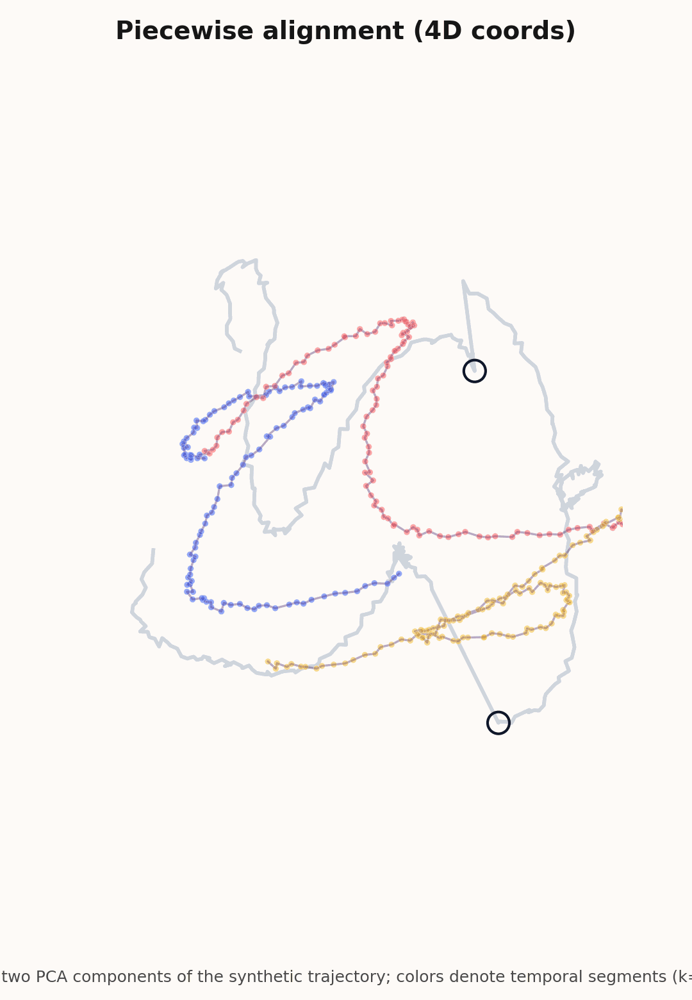

# Procrustes Embed

Small project on algorithms for *piecewise orthogonal alignment* of vectors and an application to vector embeddings. The main contribution is a dynamic-programming algorithm which finds the optimal clustering (along a given 1-dimensional ordering of the data) and cluster-wise orthogonal transformations to minimize the squared alignment error.

**Visualization of the DP algorithm:**



## Setup

Install dependencies via `pip install -r requirements.txt`.

## Experiment on synthetic data

`experiments/upstream/main_evaluation.py`, generates a synthetic
temporal-shift dataset that is favorable to piecewise alignment and compares baseline approaches (`global_procrustes`, `kmeans`,
with the DP solver).

```bash
python experiments/upstream/main_evaluation.py 
```

## Downstream applications

`experiments/downstream/partial_upgrade.py` evaluates a **partial upgrade**: documents are indexed with Model A, queries come from Model B, and we use vector alignment to learn a map from Model B to Model A that we apply before retrieval. The script reports **Recall** on held-out pairs, plus **train/test residuals**, and saves small plots/CSVs.


```bash
python experiments/downstream/partial_upgrade.py 
```

## Fast nuclear norm approximation

The DP solver performs a quadratic number of nuclear norm computations. By default, the nuclear norm is computed exactly, but we also include a fast approximation of the nuclear norm using Stochastic Lanczos Quadrature ([SLQ](https://www.cs.cornell.edu/courses/cs6241/2020sp/readings/Ubaru-2017-fast.pdf)). Pass `--nvecs` or `--steps` to tune the parameters for fast approximation.

## Project layout

- `algorithms/`: implementation of (`baseline_procrustes`, `piecewise_procrustes`, `fast_nuclear_norm`)
- `experiments/upstream/`: Alignment error and runtime on a synthetic dataset + algo visualization
- `experiments/downstream/`: a retrieval task where vector alignment improves accuracy

## Future directions

- **Runtime.** Save on the $n^2$ runtime factor with a better algorithmic idea (e.g., use Frobenius norm as proxy)
- **Quality.** Find a setting / downstream task where `piecewise_procrustes` can yield substantially better results than naive methods -- currently, it doesn't look too promising

